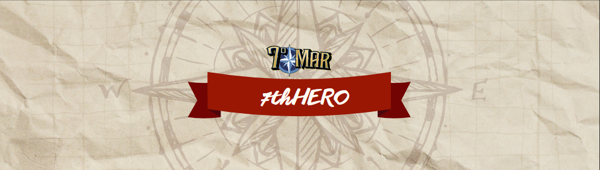
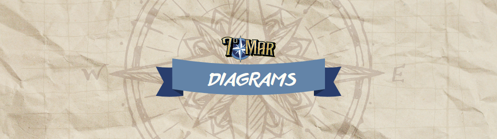
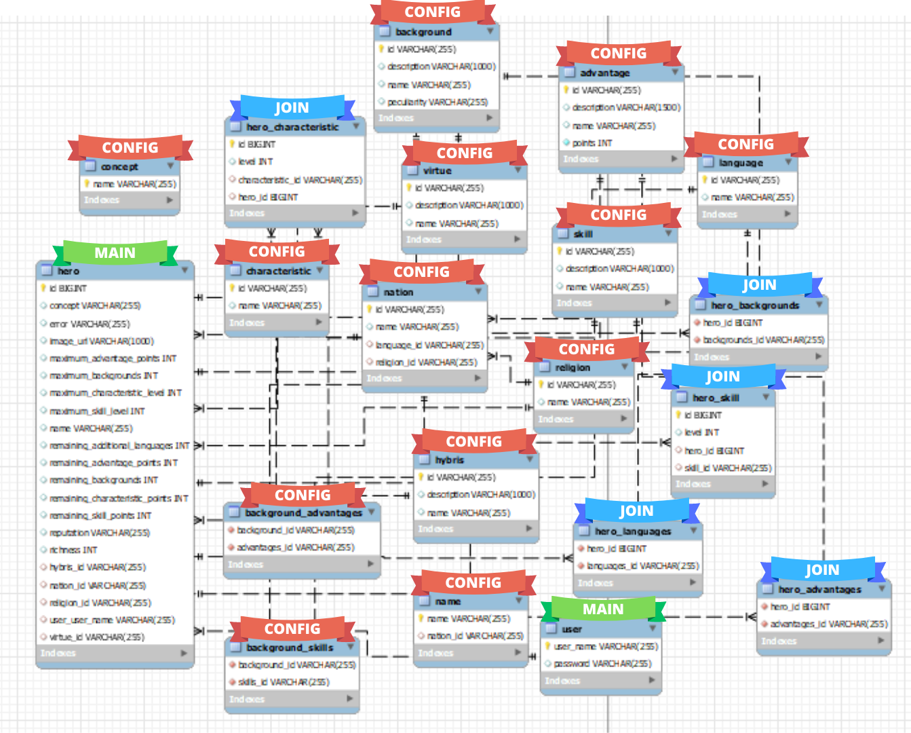
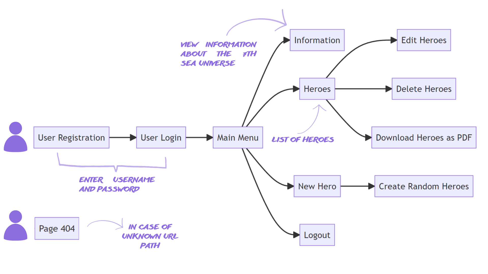
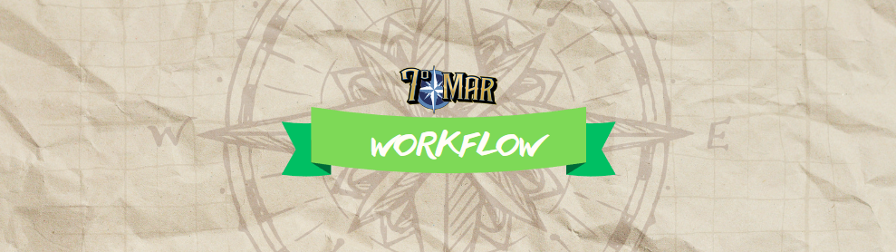
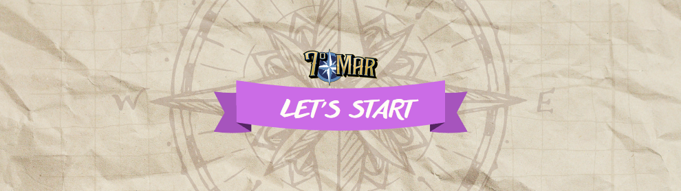

7th Hero is a web application that allows users to discover and get started with the 7th Sea game, a role-playing game of adventure and exploration. If you want to learn more about this world, I suggest you visit: https://septimomarrev.wixsite.com/revolution

The developed app allows users to create heroes (the main characters of the 7th Sea universe) with random characteristics while adhering to the rules of the core manual. Users can also edit and delete these heroes.

Furthermore, the app enables the storage and download of these heroes in editable PDF format, greatly facilitating the task of preparing and developing the characters.

The class and user diagrams are presented below:

### CLASS DIAGRAM

### USER DIAGRAM

1. User Registration

   - Enter username and password

2. User Login

   - After successful registration, the user can log in to the app

3. Main Menu 3. 1. Information

   - View information about the 7th Sea universe

   3. 2. Heroes

   - Edit heroes
   - Delete heroes
   - Download heroes as PDF

   3. 3. New Hero

   - Create random heroes

   3. 4. Logout

   - Logout from the app at any time

4. Page 404 for unknown url paths

To run the application, you need to complete the following steps in the described order:

1. Download the back-end project from the repository: https://github.com/LeyPopuli/final-project-back.git

2. Initialize the back-end application by running the file "com/charactergeneratorgroup/charactergenerator/CharacterGeneratorApplication.java".

3. Populate the database by running the file "static/bbdd_creation.sql".

4. Download the front-end project from the current repository: https://github.com/LeyPopuli/final-project-front.git

5. Install the project dependencies.

6. Initialize the front-end application.

Congratulations! You are now ready to register and become a hero!

{width='100%'}

This project has been developed by Leyre Gracia (LeyPopuli), but it wouldn't have been possible without:

1. The hero Daniel, my technical consultant and a place to cry equally.

2. The hero Jarko, who has supported and encouraged me at all times. Besides, sharing my passion for role-playing games.

3. My fellow heroes and the role-playing community, who have always shown interest in my work and given me the wings I needed.
